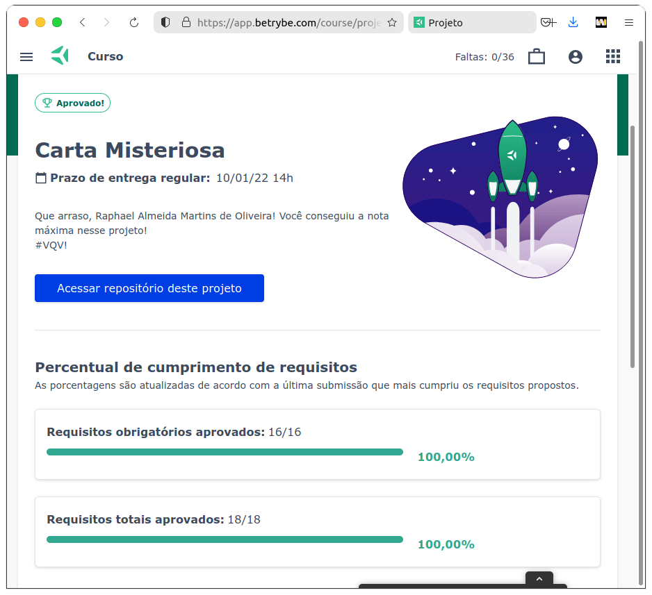

<small>(for the English version, <a href="#en">click here</a>)</small>

# Color Guess
<h2>:brazil: Português</h2>

Projeto de HTML, CSS e JavaScript desenvolvido por mim (<a href="https://www.linkedin.com/in/raphaelameidamartins/" target="_blank" rel="external">Raphael Martins</a>) ao final do Bloco 5 do Módulo 1 do curso de Desenvolvimento Web da <a href="https://www.betrybe.com" targe="_blank" rel="nofollow">Trybe</a>. Obtive aprovação com 100% dos requisitos obrigatórios e opcionais atingidos, e seguindo as todas as regras de padronização do código e boas práticas do Linter.

O projeto consistiu no desenvolvimento de uma página dinâmica que quando a pessoa usuária inserir um texto, é gerada uma carta em que cada palavra possui uma estilização aleatória.

<a href="https://raphaelalmeidamartins.github.io/project-mistery-letter/" target="_blank">Clique aqui</a> para conferir o resultado do projeto no navegador.

### Requisitos
<ol>
  <li>Deve haver um input com o <code>id="carta-texto"</code> onde a pessoa usuária poderá digitar o conteúdo da carta</li>
  <li>Deve haver um parágrafo com o <code>id="carta-gerada"</code> onde a pessoa usuária verá o resultado de sua carta misteriosa</li>
  <li>Deve haver um botão com <code>id="criar-carta"</code> e ao clicar nesse botão, a carta misteriosa deve ser gerada
    <ul>
      <li>Cada palavra deve aparecer dentro de uma tag <code>span</code>.</li>
      As tags <code>span</code> devem ser adicionadas como filhas do parágrafo <code>carta-gerada</code>.
    </ul>
  </li>
  <li>Ao criar uma carta através do botão com <code>id="criar-carta"</code>, o input com <code>id="carta-texto"</code> deve permanecer com o texto digitado</li>
  <li>Se a pessoa usuária não preencher o campo ou preencher com apenas espaços vazios adicionar a mensagem <em>'Por favor, digite o conteúdo da carta.'</em></li>
  <li>Crie a classe <code>newspaper</code> com as seguintes propriedades:
    <ul>
      <li><code>background-color</code> com o valor <code>antiquewhite</code></li>
      <li><code>font-family</code> com o valor <code>Times New Roman</code></li>
      <li><code>font-weight</code> com o valor <code>bold</code></li>
    </ul>
  </li>
  <li>Crie a classe <code>magazine1</code> com as seguintes propriedades:
    <ul>
      <li><code>background-color</code> com o valor <code>teal</code></li>
      <li><code>color</code> com o valor <code>white</code></li>
      <li><code>font-family</code> com o valor <code>Verdana</code></li>
      <li><code>font-weight</code> com o valor <code>900</code></li>
      <li><code>text-transform</code> com o valor <code>uppercase</code></li>
    </ul>
  </li>
  <li>Crie a classe magazine2 com as seguintes propriedades:
    <ul>
      <li><code>background-image</code> com a imagem <code>images/pink-pattern.png</code></li>
      <li><code>color</code> com o valor <code>fuchsia</code></li>
      <li><code>font-family</code> com o valor <code>Verdana</code></li>
      <li><code>font-weight</code> com o valor <code>900</code></li>
    </ul>
  </li>
  <li>Crie a classe <code>medium</code> com as seguintes propriedades:
    <ul>
      <li><code>font-size</code> com o valor <code>20px</code></li>
      <li><code>padding</code> com o valor <code>8px</code></li>
    </ul>
  </li>
  <li>Crie a classe <code>big</code> com as seguintes propriedades:
    <ul>
      <li><code>font-size</code> com o valor <code>30px</code></li>
      <li><code>padding</code> com o valor <code>10px</code></li>
    </ul>
  </li>
  <li>Crie a classe <code>reallybig</code> com as seguintes propriedades:
    <ul>
      <li><code>font-size</code> com o valor <code>40px</code></li>
      <li><code>padding</code> com o valor <code>15px</code></li>
    </ul>
  </li>
  <li>Crie a classe <code>rotateleft</code> com as seguintes propriedades:
    <ul>
      <li><code>transform</code> com o valor <code>rotate(-5deg)</code></li>
    </ul>
  </li>
  <li>Crie a classe <code>rotateright</code> com as seguintes propriedades:
    <ul>
      <li><code>transform</code> com o valor <code>rotate(5deg)</code></li>
    </ul>
  </li>
  <li>Crie a classe <code>skewleft</code> com as seguintes propriedades:
    <ul>
      <li><code>transform</code> com o valor <code>skewX(10deg)</code>;</li>
    </ul>
  </li>
  <li>Crie a classe <code>skewright</code> com as seguintes propriedades:
    <ul>
      <li><code>transform</code> com o valor <code>skewX(-10deg)</code>;</li>
    </ul>
  </li>
</ol>

### Bônus
<ol start="17">
  <li>Com uma carta misteriosa gerada, adicione a possibilidade de alterar o estilo de uma palavra específica ao clicar nela
    <ul>
      <li>Ao clicar em uma palavra, um novo estilo <strong>aleatório</strong> deve ser aplicado.</li>
      <li>O número de mudanças deve ser ilimitado;</li>
    </ul>
  </li>
</ol>
 

<h2 id="en">:us: English</h2>

Project of HTML, CSS and JavaScript develop by me (<a href="https://www.linkedin.com/in/raphaelameidamartins/" target="_blank" rel="external">Raphael Martins</a>) in the end of the Unit 5 Module 1 of the Web Development course at <a href="https://www.betrybe.com" targe="_blank" rel="nofollow">Trybe</a>. I was approved with 100% of the mandatory and optional requirements met, and following all the Linter rules of best practices and code standardization.

We had to develop a dynamic web page that when the user inserts a text, a letter is generated, with each word having a randomly selected style.

<a href="https://raphaelalmeidamartins.github.io/project-mistery-letter/" target="_blank">Click here</a> to check out the final version of the project on your browser.

### Requirements

(Under development)

### Bonus

(Under development)
